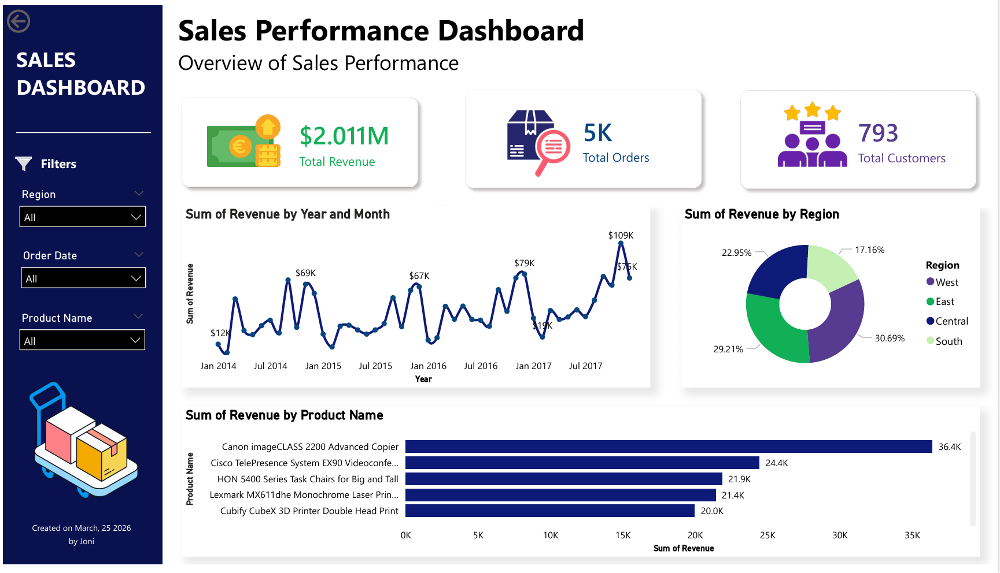

# 🚀 End-to-End Data Pipeline & BI Dashboard Project

## 📌 Overview
This project demonstrates an end-to-end data engineering workflow, starting from raw data ingestion to delivering actionable insights through a BI dashboard.

The pipeline includes:
- Data extraction from CSV [data source](https://www.kaggle.com/datasets/konstantinognev/sample-superstorecsv?resource=download)
- Data validation (data quality checks)
- Data transformation using Python (pandas)
- Loading data into a relational database (PostgreSQL)
- SQL-based analysis
- Visualization using BI tools (Power BI / Looker Studio)

---

## 🎯 Business Problem
Simulate an e-commerce business scenario to answer key questions:
- What is the total revenue over time?
- Which products generate the most revenue?
- Which regions are the most profitable?
- Who are the most active customers?

---

## 🧱 Project Architecture
CSV → Python (Extract, Validate, Transform) → PostgreSQL → SQL → BI Dashboard

---

## 📂 Project Structure
```bash
data-pipeline-project/
│
├── data/
│ ├── raw/
│ │ └── superstore.csv
│ └── processed/
│ └── clean_data.csv
│
├── logs/
│ └── pipeline.log
│
├── scripts/
│ ├── extract.py
│ ├── validate.py
│ ├── transform.py
│ ├── load.py
│ ├── logger.py
│
├── sql/
│ └── analysis.sql
│
├── main.py
└── README.md
```
---

## ⚙️ Tech Stack

- **Python** (pandas, sqlalchemy)
- **SQL** (PostgreSQL)
- **Data Processing**: pandas
- **Logging**: Python logging module
- **BI Tools**: Power BI / Looker Studio

---

## 🔄 Pipeline Workflow

### 1. Extract
- Load raw CSV dataset into pandas DataFrame

### 2. Validate
Data quality checks:
- Null value detection
- Duplicate detection
- Schema validation (required columns)

### 3. Transform
- Convert date format
- Create new column (`Revenue`)
- Remove duplicates
- Apply business rules

### 4. Load
- Store cleaned data into PostgreSQL table (`sales_data`)

### 5. Analyze
- Execute SQL queries for business insights

### 6. Visualize
- Build dashboard for decision-making

---

## 🛡️ Data Validation Rules

- Check for missing values
- Remove duplicate records
- Validate required columns exist
- Detect invalid business logic (e.g., negative revenue)

---

## 🧾 Logging

Pipeline logging is implemented to:
- Track execution flow
- Capture warnings (data issues)
- Log errors for debugging

Example log:
```log
2026-04-23 21:25:28,600 - INFO - Data shape: (9994, 21)
2026-04-23 21:25:28,601 - INFO - Columns: ['Row ID', 'Order ID', 'Order Date', 'Ship Date', 'Ship Mode', 'Customer ID', 'Customer Name', 'Segment', 'Country', 'City', 'State', 'Postal Code', 'Region', 'Product ID', 'Category', 'Sub-Category', 'Product Name', 'Sales', 'Quantity', 'Discount', 'Profit']
2026-04-23 21:25:28,601 - INFO - Validating data...
2026-04-23 21:25:28,618 - INFO - Transforming data...
2026-04-23 21:25:28,736 - INFO - Loading to database...
2026-04-23 21:25:30,076 - INFO - Data loaded successfully
2026-04-23 21:25:30,076 - INFO - Pipeline finished successfully
```
---

## 🧮 Sample SQL Queries

### Revenue per Month
```sql
SELECT 
    DATE_TRUNC('month', "Order Date") AS month,
    SUM("Revenue") AS total_revenue
FROM sales_data
GROUP BY 1
ORDER BY 1
```

##📊 Dashboard
The final dataset is used to build a BI dashboard with:
- KPI: Total Revenue, Total Orders
- Revenue trend over time
- Top products by revenue
- Revenue distribution by region


## 💡 Key Highlights
- End-to-end data pipeline implementation
- Real-world data validation practices
- SQL-driven analytics
- Business-oriented insights
- Production-like logging and structure

## ⭐ Notes
This project is built to showcase practical data engineering skills aligned with industry requirements, including ETL processes, data validation, SQL analytics, and BI integration.

## 👤 Author

Joni Syofian
Data Engineer | Technical Consultant

Email: jonisyofian14@gmail.com <br>
GitHub: https://github.com/jonisy1406 <br>
LinkedIn: https://linkedin.com/in/jonisyofian
